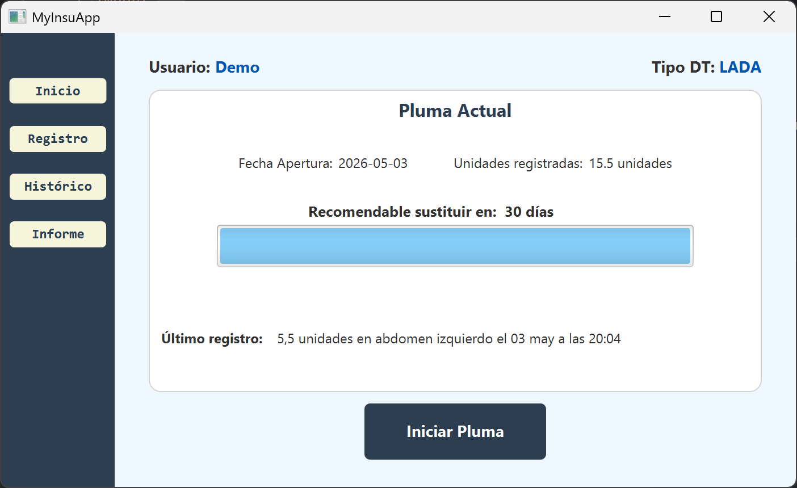
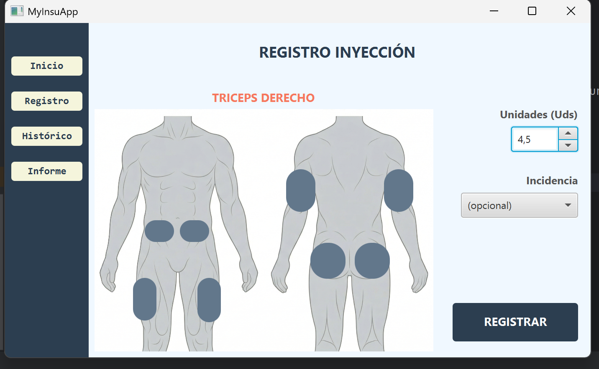
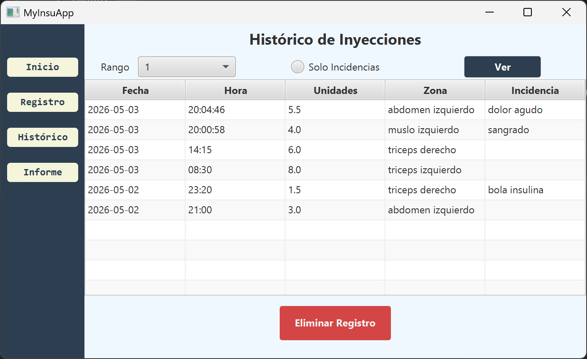
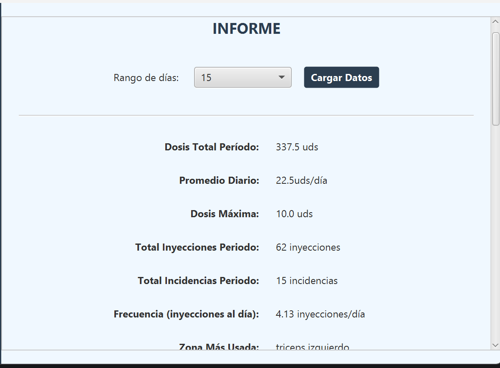
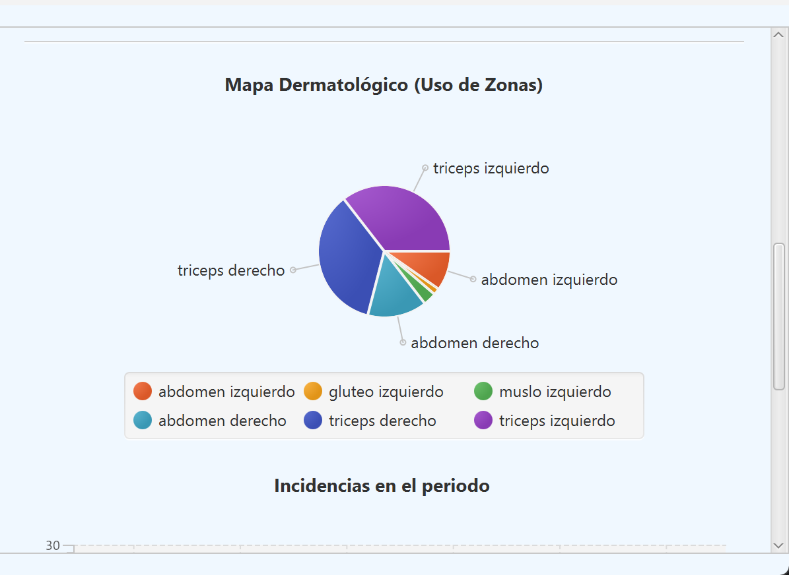
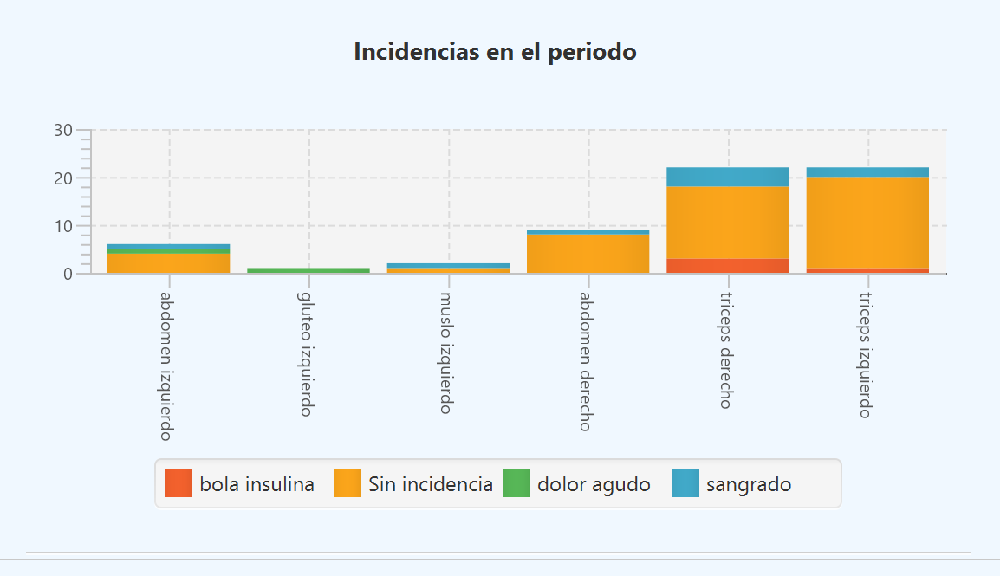

# MyInsuApp


## 1. Qué es el proyecto

MyInsuApp es una solución de escritorio orientada al sector e-Health, diseñada para optimizar el seguimiento médico y
el autocontrol de pacientes con Diabetes Mellitus insulinodependientes. En esta primera fase consiste en un MVP centrado en la gestión diaria
de la administración de insulina, proporcionando una herramienta técnica fiable para el registro y análisis de la terapia diaria.

## Proposito y problemática

* **Problema:** Uno de los mayores riesgos para el paciente insulinodependiente, que a veces queda bajo el radar de riesgos más inmediatos o impactantes para la salud a largo plazo, es la lipodistrofia. Esta complicación surge por la repetición constante de inyecciones en la misma zona, lo que no solo afecta a la estética, sino que vuelve errática la absorción de la insulina, poniendo en riesgo el control glucémico.
* **Solución:** MyInsuApp resuelve la falta de registro preciso mediante un sistema de trazabilidad de punción. La aplicación permite registrar cada dosis vinculándola a una zona anatómica específica, la hora exacta y de forma opcional, la señalización de incidencias durante la inyección. Con esto se garantiza una rotación correcta y saludable de los puntos de inyección.

## Tecnologías usadas

* **Lógica de negocio:** Java, para una arquitectura robusta y un manejo eficiente de los objetos de salud.
* **Interfaz gráfica:** JavaFX, centrado en mostrar de forma clara los datos y acciones del usuario.
* **Persistancia de datos:** MariaDB (SQL), asegurando un almacenamiento estructurado y bien relacionado con consultas eficientes.
* **Reportes:** XML, utilizado para la generación y estructuración del informe médico.
* **Gestión de proyectos:** **Maven** para dependencias y **GitHub** para el control de versiones.


## Instrucciones de instalación

**1. Programas necesarios:**
*   **JDK 21** (Java).
*   **XAMPP** (usaremos su módulo de MySQL/MariaDB).
*   **IntelliJ IDEA** (IDE recomendado, es donde se ha desarrollado).

**2. Librerías y dependencias:**
No hay que descargar nada a mano. Al abrir el proyecto, Maven (a través del archivo `pom.xml`) se encarga de descargar automáticamente:
*   **JavaFX (21.0.6):** Para la interfaz gráfica.
*   **MySQL Connector/J (9.4.0):** Para conectar con la base de datos.
*   **Jakarta XML Bind (4.0.5):** Para leer y guardar archivos XML.

**3. Descarga del proyecto:**
- Entrar al enlace de GitHub y descargar el código: https://github.com/Eloy-i/MyInsuApp
- Descomprimir el archivo en una carpeta local.

**4. Preparación de la Base de Datos:**
- Abrir XAMPP y arrancar el servicio de MySQL.
- El usuario de la base de datos es `root` con contraseña `root`.
- Entrar a phpMyAdmin y ejecutar los scripts de la carpeta `/sql` en este orden:
    *   Primero `01_esquema.sql` (crea la base de datos y las tablas).
    *   Segundo `02_inserts.sql` (mete los datos de prueba).

**5. Arranque de la aplicación:**
- Abrir la carpeta del proyecto ya descomprimida con IntelliJ IDEA.
- Asegurar  que IntelliJ lea el `pom.xml` y descargue las dependencias.
- En el árbol de carpetas, ir a: `src/main/java/org/example/myinsuapp/Launcher.java`.
- Hacer clic en el botón de "Play" para iniciar la aplicación.

**6. Usuarios de prueba:**
La base de datos viene cargada con un "usuario demo" (ID 1) que tiene datos de todo un mes, ideal para probar cómo se ven las gráficas y el historial.
Si se quiere probar la app desde cero con un usuario limpio, hay que ir al archivo:
`src/main/java/org/example/myinsuapp/service/EstadoService.java`
Y cambiar la línea: `private final int ID_USUARIO_DEMO = 1;` por un `2`.

## Estructura del Repositorio

* **/src:** Código fuente del proyecto -> Destinado a Borja -Programación y MPO-
* **/sql:** Scrips de creación insert y consulta -> También para Borja y para Luz (Base de datos)
* **docs/xml:** Documentación y esquemas de exportación de datos y validación -> Para José (Lenguaje de Marcas)
* **docs/diagrams:** Modelado de datos ER y Relacional. -> Para Luz (Base de datos)
* **/docs/sistemas:** Informe técnico y muestra de funcionamiento -> Para Olga (Sistemas)
* **docs/empleabilidad:** Documentos profesionales -> Para Carlos (Empleabilidad)

## Capturas y video de funcionamiento

```markdown






[Ver vídeo de demostración](docs/sistemas/captura_funcionamiento_y_error.mp4)